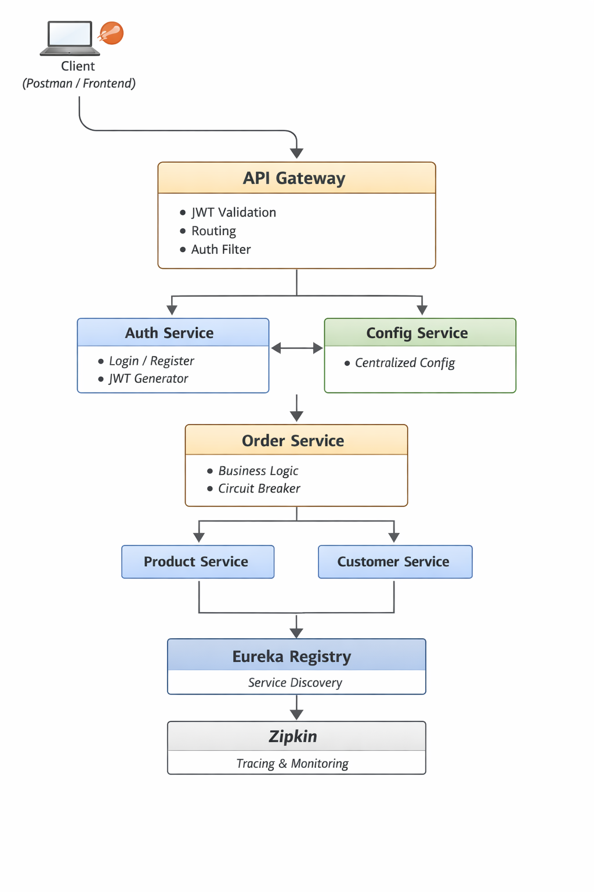

# Spring Boot Microservices Architecture

This project demonstrates a production-style microservices architecture built using Spring Boot and Spring Cloud.

The system focuses on:
- Centralized authentication
- API Gateway security
- Service discovery
- Centralized configuration
- Fault tolerance using circuit breaker
- Distributed tracing

---

## Architecture Overview

---

## Services

### API Gateway
- Single entry point for all requests
- JWT validation
- Route-based authorization
- Internal request forwarding

### Auth Service
- User registration and authentication
- JWT token generation
- Centralized security management

### Order Service
- Handles order processing
- Communicates with Product and Customer services
- Implements Circuit Breaker using Resilience4j

### Product Service
- Manages product data
- Provides product information to Order Service

### Customer Service
- Manages customer data
- Provides customer information to Order Service

### Config Service
- Centralized configuration using Spring Cloud Config
- Externalized application configuration

### Registry Service (Eureka)
- Service discovery
- Enables dynamic service registration

---

## Security Flow

1. User authenticates via Auth Service
2. Auth Service generates a JWT token
3. Client sends request with JWT to API Gateway
4. API Gateway validates JWT
5. Gateway forwards request with internal header
6. Microservices accept requests only from API Gateway

---

## Resilience & Fault Tolerance

- Circuit Breaker implemented using Resilience4j
- Prevents cascading failures
- Order Service remains available even if Product Service is down
- Supports CLOSED → OPEN → HALF_OPEN states

---

## Observability

- Distributed tracing using Zipkin
- Actuator endpoints for health monitoring
- Circuit breaker health indicators

---

## Tech Stack

- Java 17
- Spring Boot
- Spring Cloud Gateway
- Spring Security (JWT)
- Spring Cloud Config
- Eureka Discovery Server
- Resilience4j
- Zipkin
- MySQL
- Docker & Docker Compose

---

## How to Run 
Running the Project with Docker (Recommended)

Prerequisites
- Docker
- Docker Compose

Start All Services

docker compose up -d

This will start:

1. Eureka Registry
2. Config Server
3. API Gateway
4. Auth Service
5. Order Service
6 Product Service
7. Customer Service
8. Zipkin
10. MySQL databases for each service

---

## Notes

- All services are designed to be accessed only via API Gateway
- Direct access to service ports is restricted
